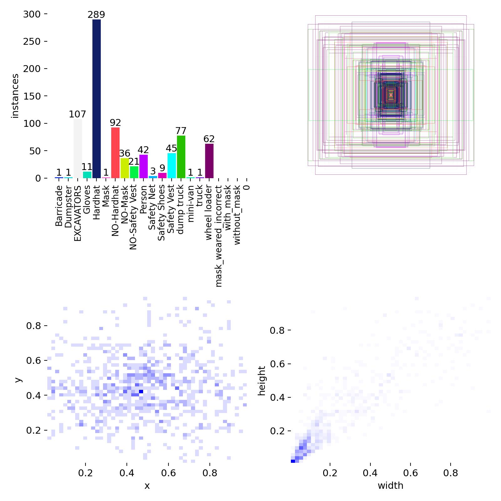

# 🛡️ Hazards and Stepped Prevention (HSP)
**Real-Time Unified Industrial & Public Safety Monitoring Station**

[](https://www.python.org/)
[](https://github.com/ultralytics/ultralytics)
[](https://streamlit.io/)
[](https://developer.nvidia.com/cuda-zone)

> 🎥 **Watch the PyTorch Demo:** [Standard Setup (.pt)](https://drive.google.com/file/d/1yUAbW96z2RkdWwW4kkkw15rUINRetXIU/view?usp=drive_link)
> ⚡ **Watch the TensorRT Demo:** [High-Speed Edge Compute (~198 FPS)](https://drive.google.com/file/d/1UunbIDqlzclGCp_nmz8Eg2Y8J_-UO07-/view?usp=drive_link)

## 📌 The Motive
Industrial sites, construction zones, and crowded public facilities share a critical safety bottleneck: **human monitoring fatigue**. Relying on humans to continuously watch CCTV feeds inevitably leads to delayed responses to Personal Protective Equipment (PPE) violations or dangerous proximity to heavy machinery.

The **Hazards and Stepped Prevention (HSP)** system was built to shift safety protocols from reactive reporting to **proactive, real-time prevention**. By deploying computer vision directly at the edge, this system actively monitors high-risk zones and triggers automated alerts the millisecond a safety prerequisite is breached.

---

## 🧠 System Architecture

This application is powered by a custom-trained **YOLOv8** Convolutional Neural Network. Instead of running multiple heavy models for different environments, this engine uses a single, unified dataset containing **21 distinct classes**.

### 1. The Unified Matrix
* **Industrial Machinery Logic:** Tracks heavy equipment (`EXCAVATOR`, `dump truck`, `wheel loader`) to prevent struck-by accidents.
* **PPE Compliance Tracking:** High-precision detection for required gear like `Hardhat` and `Safety Vest`.
* **Public Health Dynamics:** Integration of `Mask` detection for versatile indoor/outdoor deployment.

### 2. Hazard Logic (The `NO-` Protocol)
The system doesn't just detect objects; it detects the *absence* of required safety gear. By utilizing logical inversion classes (e.g., `NO-Hardhat`, `NO-Safety Vest`), the model acts as an automated safety barrier. It actively logs asynchronous alerts when a worker enters a restricted frame without the necessary equipment.

### 3. Asynchronous WebRTC Dashboard
To eliminate the UI-blocking lag common in Python computer vision apps, the control center utilizes **Web Real-Time Communication (WebRTC)**. This decouples the video transmission from the neural network inference, allowing the browser to maintain smooth video playback while the GPU crunches the matrix calculations in the background.

---

## 🚀 Performance & Hardware Optimization
The deployment architecture is highly optimized for local Edge computing, completely bypassing cloud latency. 

* **Hardware Target:** Consumer-grade NVIDIA architectures (Developed on the RTX 50 Series).
* **Inference Speed:** Capable of high FPS using native PyTorch (`.pt`) weights, but fully optimized with **NVIDIA TensorRT (`.engine`)** layer fusion for maximum production efficiency (achieving nearly 200 FPS).
* **Telemetry:** Features real-time VRAM monitoring and automated, exportable incident logging via Pandas DataFrames.

---
## 📸 System Previews

### 1. Live Monitoring Station (Powered by TensorRT)
*Achieving high-speed edge compute using custom TensorRT FP16 layer fusion, successfully triggering asynchronous 'NO-Hardhat' alerts.*


### 2. Analytics & Incident Reporting
*Real-time automated logging of safety violations into a Pandas DataFrame, featuring one-click CSV report exporting for compliance managers.*

---
## 📊 Training Results & Model Evaluation
The YOLOv8 unified model was trained over 100 epochs, evaluating 21 distinct classes. The performance metrics below highlight the model's proficiency in core industrial hazard detection.

### 1. Training Convergence (`results.png`)

The training graphs demonstrate healthy model convergence. The **Box Loss** and **Class Loss** decrease consistently across both training and validation sets, indicating the model successfully learned spatial boundaries without severe overfitting.

### 2. Dataset Distribution (`labels.jpg`)

Our dataset mimics real-world industrial environments, inherently featuring an imbalanced class distribution. The model possesses highly robust training data for primary safety features:
* `Hardhat`: 289 instances
* `EXCAVATORS`: 107 instances
* `Mask` / `NO-Mask`: 128 combined instances
*(Note: Minor classes like `Gloves` and `Safety Net` were included for architectural scaling but have lower instance counts).*

### 3. Confusion Matrix Analysis

The normalized confusion matrix proves the system's high reliability in preventing heavy-machinery accidents.
* **Heavy Machinery:** `EXCAVATORS` achieved **1.00 (100%) accuracy**, while `wheel loader` (82%) and `dump truck` (75%) also showed strong true-positive rates.
* **PPE Detection:** The model successfully isolates `Hardhat` features (58%), though background elements in highly complex environments can occasionally mimic safety gear. 

### 4. Precision, Recall, and F1-Score Confidence

* **Precision-Recall (PR) Curve:** The model achieved an overall `mAP@0.5` of **0.307**. However, class-specific PR curves reveal that critical safety classes perform exceptionally well (e.g., `wheel loader` at 0.931 and `dump truck` at 0.764).
* **Optimal Confidence:** The F1-Confidence curve indicates an optimal global confidence threshold of **0.667** for a peak balance between Precision and Recall. The live Control Center UI features an adjustable threshold, allowing site managers to prioritize Recall (ensuring no hazard is missed).

---
## ⚙️ Local Setup (For Evaluators)
*Note: Due to GitHub file size limits, the heavy `best.pt` model weights and raw datasets are not included in this repository. Please view the demo videos linked at the top for the complete system walkthrough.*

```bash
# 1. Clone the repository
git clone https://github.com/sachinrao090/HazardsAndStemppedPrevention.git

# 2. Install dependencies
pip install -r requirements.txt

# 3. Launch the Control Center
streamlit run app.py